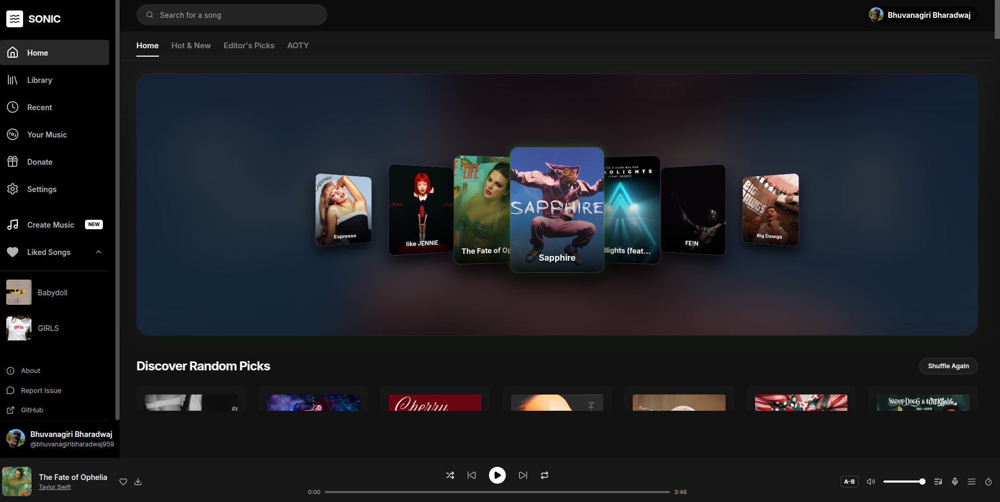
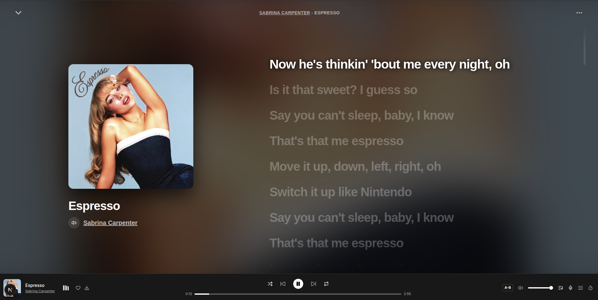

# Sonic - Music Streaming Application

Sonic is a full-stack music streaming platform built with Next.js, React, TypeScript, and Firebase. It provides high-fidelity audio playback up to 320kbps, real-time synchronized lyrics, user library management, and dynamic visual interfaces without relying on third-party client audio players.

---

## User Interface

### Main Dashboard Interface


### Immersive Song Playing View


---

## System Architecture

The application follows a client-server architecture with Next.js App Router API proxy layer to handle media decryption, CORS management, and multi-source lyrics resolution.

```
+-----------------------------------------------------------------------------------+
|                                 CLIENT SIDE                                       |
|                                                                                   |
|  +------------------+     +--------------------+     +-------------------------+  |
|  | Dashboard View   |     | Playing View       |     | Canvas Visualizer       |  |
|  | Track Grid & Hero|     | Vinyl Art & Lyrics |     | Audio Particle Canvas   |  |
|  +--------+---------+     +---------+----------+     +------------+------------+  |
|           |                         |                             |               |
|           +-------------------------+-----------------------------+               |
|                                     |                                             |
|                             HTML5 Audio Element                                   |
+-------------------------------------|---------------------------------------------+
                                      |
                                  HTTP Requests
                                      |
+-------------------------------------v---------------------------------------------+
|                                NEXT.JS SERVER                                     |
|                                                                                   |
|  +-------------------------+     +-------------------+     +-------------------+  |
|  | /api/song               |     | /api/stream       |     | /api/search       |  |
|  | Decryption & Metadata   |     | Audio Proxy Stream|     | Search & Cache    |  |
|  +------------+------------+     +---------+---------+     +---------+---------+  |
+---------------|----------------------------|-------------------------|------------+
                |                            |                         |
        +-------+--------+                   |                 +-------+--------+
        |                |                   |                 |                |
        v                v                   v                 v                v
  +-----------+    +-----------+     +---------------+   +-----------+    +-----------+
  | JioSaavn  |    | LRCLIB /  |     | JioSaavn CDN  |   | JioSaavn  |    | Firebase  |
  | Auth API  |    | Genius    |     | Audio Source  |   | Search API|    | Firestore |
  +-----------+    +-----------+     +---------------+   +-----------+    +-----------+
```

### Data Flow Lifecycle

1. **User Selection**: When a user selects a song or executes a search, the client sends a request to `/api/search` or `/api/song`.
2. **Metadata & Token Resolution**: `/api/song` accepts the track payload, extracts the JioSaavn song identifier and encrypted media URL, and queries the JioSaavn Auth API to generate a decrypted 320kbps media stream token.
3. **Lyrics Extraction**: Concurrently, `/api/song` queries primary and fallback lyric services (LRCLIB, lyrics.ovh, Lyrica Proxy, and Genius) to aggregate synchronized (`.lrc`) or plain text lyrics.
4. **Secure Proxy Streaming**: To overcome cross-origin policies (CORS) and preserve stream integrity, audio content is requested via `/api/stream?url=<cdn_url>`. The Next.js backend validates the CDN source hostname (`web.saavncdn.com`, `aac.saavncdn.com`, `c.saavncdn.com`), passes range headers, and streams binary chunks back to the client.
5. **Client Playback & Synchronization**: The client receives the streamed audio, binds it to the HTML5 Audio element, drives visualizer spectrum canvas animations, and synchronizes real-time lyrics by tracking current audio timestamp (`currentTime`).

---

## Song Identifier System

### How Unique Song IDs are Assigned

Every song in the Sonic ecosystem is identified by a unique string ID assigned at data ingestion or API resolution.

| Field Name | Type | Description | Example |
|---|---|---|---|
| `id` | String | Unique provider-assigned primary key | `"003531d7bdf1403394a15107c4dc9e4a"` |
| `title` | String | Track title string | `"Midnight Echoes"` |
| `artist` | String | Primary artist name | `"The Luna Collective"` |
| `album` | String (Optional) | Album or collection name | `"Lunar Sessions"` |
| `encryptedMediaUrl` | String (Optional) | Encrypted provider stream string | `"8MTJ,,eOQ2s_..."` |
| `permaUrl` | String (Optional) | Canonical web URL of the track | `"https://www.jiosaavn.com/song/..."` |

### ID Assignment and Lifecycle Mechanics

1. **Pre-Cataloged Static Store (`public/jiosaavn_songs.json`)**
   - The project includes an automated ingestion script (`scripts/fetch-english-songs.js`) that fetches popular playlists and top artist tracks from JioSaavn.
   - Each track retains its unique provider hash `song.id`. The generated dataset is indexed into `public/jiosaavn_songs.json` containing 1,000+ top tracks.

2. **On-The-Fly API Search & Dynamic IDs**
   - When a user performs a search via `/api/search`, results are assigned the raw provider ID returned by the upstream endpoint (`rawData.results[i].id`).
   - If temporary fallback items are generated client-side during loading states, predictable key prefixes (`loading-<timestamp>`) are assigned until raw data resolves.

3. **Database Relationships & Firestore Persistence**
   - User interactions such as liked tracks, custom playlists, and playback history utilize `song.id` as the primary reference key in Firebase Firestore.
   - Database schema path: `users/{userId}/likedSongs/{songId}` and `users/{userId}/history/{songId}`.
   - This ensures lightweight storage footprint while maintaining referential integrity across application sessions.

4. **Stream Decryption Lookup**
   - The `id` is transmitted to `/api/song` in POST requests.
   - If an `encryptedMediaUrl` is not cached locally, the server uses `id` to query `https://www.jiosaavn.com/api.php?__call=song.getDetails&pids={id}`.
   - The fetched token is decrypted via `song.generateAuthToken` to extract the playable 320kbps audio link.

---

## External APIs and Backend Services

Sonic integrates multiple specialized APIs to provide music search, audio streaming, lyrics synchronization, and backend state persistence.

### 1. Music Provider API (JioSaavn Internal Web API)
- **Endpoint**: `https://www.jiosaavn.com/api.php`
- **Purpose**: Source of track metadata, search results, high-resolution album artwork, and audio decryption.
- **Key Calls**:
  - `search.getResults`: Fetches matching tracks for search queries.
  - `song.getDetails`: Fetches full song payload using product IDs (`pids`).
  - `song.generateAuthToken`: Decrypts `encrypted_media_url` into direct 320kbps audio stream links.

### 2. Stream Proxy Engine (`/api/stream`)
- **Purpose**: Internal Next.js API route that proxies media streams from verified CDN hosts.
- **Allowed Hosts**: `web.saavncdn.com`, `aac.saavncdn.com`, `c.saavncdn.com`.
- **Features**: CORS compliance, `Accept-Ranges` support, and client-side byte chunk streaming.

### 3. Synchronized & Plain Text Lyrics APIs
- **LRCLIB API (`https://lrclib.net/api/get` & `/search`)**: Primary source for timestamped synchronized lyrics (`.lrc` format).
- **Lyrics.ovh API (`https://api.lyrics.ovh/v1`)**: Secondary fallback for plain text lyrics.
- **Lyrica Proxy Engine**: Fast metadata and timestamped lyric lookup fallback.
- **Genius API (`https://api.genius.com`)**: Final fallback for scraping track lyrics when Genius API key is configured.

### 4. Firebase Services
- **Firebase Authentication**: Handles email/password sign-up, sign-in, session state, and password reset flows.
- **Firebase Firestore**: Stores user profiles, preferences, liked track IDs, custom playlist metadata, and play history.

---

## Core Features

- **High-Definition Audio Playback**: Streams 320kbps audio through an internal proxy server with timeline scrubbing, volume controls, shuffle, and repeat modes.
- **Real-Time Synchronized Lyrics**: Automatic lyric retrieval with line-by-line active highlighting synced to audio time tracking.
- **Interactive Visualizers**: HTML5 Canvas pixel particle animations and audio spectrum equalizer effects.
- **Library & Playlist Management**: Save tracks to Liked Songs, construct playlists, and track recently played media linked to Firebase user accounts.
- **Dynamic Search & Caching**: Fast search autocomplete backed by server-side memory caching with 1-hour time-to-live (TTL).
- **Responsive Dark Theme UI**: Built with custom CSS, Tailwind CSS, Framer Motion, and Swiper carousel components.

---

## Technology Stack

- **Framework**: Next.js 16 (App Router)
- **Library & Language**: React 19, TypeScript
- **Styling**: Vanilla CSS, Tailwind CSS v4, Framer Motion
- **Database & Auth**: Firebase Firestore, Firebase Authentication
- **Icons & Components**: Lucide React, Swiper
- **Utilities**: Node.js Native Fetch, AbortController Timeouts

---

## Project Structure

```
spotify-type/
├── app/
│   ├── api/
│   │   ├── artist/          # Artist detail resolution endpoint
│   │   ├── search/          # Search API with server-side caching
│   │   ├── song/            # Audio token decryption & lyrics pipeline
│   │   └── stream/          # Secure proxy stream handler for CDN audio
│   ├── components/
│   │   ├── dashboard.tsx    # Main streaming player & catalog dashboard
│   │   ├── playing.tsx      # Full-screen player with synchronized lyrics
│   │   ├── login.tsx        # Authentication login component
│   │   └── sign-up.tsx      # User registration component
│   ├── layout.tsx           # Global app layout configuration
│   └── page.tsx             # Root page redirect handler
├── public/
│   ├── assets/              # Interface screenshots and documentation assets
│   ├── jiosaavn_songs.json  # Pre-cataloged dataset of 1,000+ tracks
│   └── cache/               # Server-side audio stream cache
├── scripts/
│   └── fetch-english-songs.js # Automated data ingestion script
└── README.md
```

---

## Local Development Setup

### Prerequisites

- Node.js (v18.0.0 or higher recommended)
- npm or yarn package manager

### Environment Configuration

Create a `.env.local` or `.env` file in the root directory:

```env
GENIUS_API_KEY=your_genius_api_key_here
NEXT_PUBLIC_FIREBASE_API_KEY=your_firebase_api_key
NEXT_PUBLIC_FIREBASE_AUTH_DOMAIN=your_firebase_auth_domain
NEXT_PUBLIC_FIREBASE_PROJECT_ID=your_firebase_project_id
NEXT_PUBLIC_FIREBASE_STORAGE_BUCKET=your_firebase_storage_bucket
NEXT_PUBLIC_FIREBASE_MESSAGING_SENDER_ID=your_messaging_sender_id
NEXT_PUBLIC_FIREBASE_APP_ID=your_firebase_app_id
```

### Installation

1. Clone the repository and navigate to the project root:
   ```bash
   cd spotify-type
   ```

2. Install dependencies:
   ```bash
   npm install
   ```

3. Run the development server:
   ```bash
   npm run dev
   ```

4. Open `http://localhost:3000` in your web browser.

---

## License & Disclaimer

This project is built strictly for educational and portfolio demonstration purposes. All music streams, metadata, and lyrics are processed on-the-fly without permanent redistribution of copyrighted media. Copyrights belong to their respective owners and rights holders.
